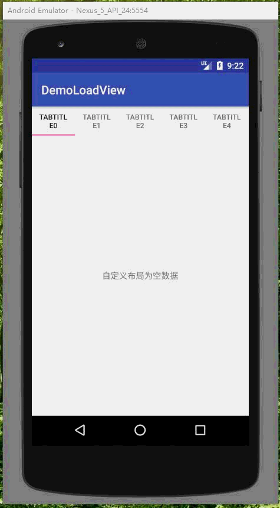

# LoadViewHelper


#切换加载中，加载失败，加载成功布局，支持全局和局部之自定义布局 定义一个LoadViewHelper所有界面通用，无需添加布局中view, 大大降低耦合性。

## LoadViewHelper
通过Gradle抓取:

```gradle
compile 'com.ycjiang:loadviewhelper:1.1.0'

```
```Maven
<dependency>
  <groupId>com.ycjiang</groupId>
  <artifactId>loadviewhelper</artifactId>
  <version>1.1.0/version>
  <type>pom</type>
</dependency>
````
### 更新日志
  #### 1.1.0 
   * 1.优化内部处理，代码更简洁  
    * 1.增加弹打入染出效果。  


### 在你Framgment 或者ACtivity

```
    LoadViewHelper helper = new LoadViewHelper(listView);  
	    //将listview切换成显示加载中布局

		helper.showLoading("加载中...");

		//将listview切换成显示空数据布局
		helper.showEmpty("暂无数据", "重试");
		//或者
		helper.showEmpty();
	//	监听重试按钮
		  helper.setListener(new OnLoadViewListener() {
                    @Override
                    public void onRetryClick() {
                        Toast.makeText(getApplicationContext(), "点击了重试", Toast.LENGTH_SHORT).show();
                    }
      });
```

## 可以 自定义 加载中，加载失败，加载为空 布局 实现自己加载效果
###  使用全部自定义布局
```
public class App extends Application {

    @Override
    public void onCreate() {
        super.onCreate();
            LoadViewHelper.getBuilder()
                .setLoadEmpty(R.layout.this_empty)
                .setLoadError(R.layout.this_error)
                .setLoadIng(R.layout.this_load_ing);
    }
}
```

### 使用局部自定义布局
```java
  helper.setLoadEmpty(view)
  helper.setLoadEmpty(resId);
  helper.getLoadIng(view);
  helper.getLoadIng(resId);
 ```





